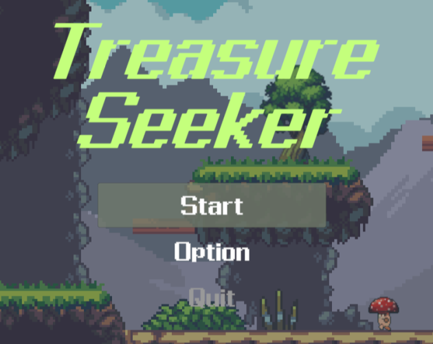
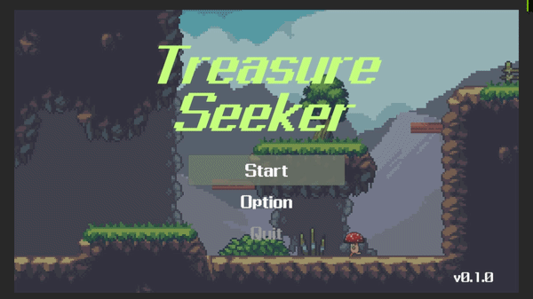
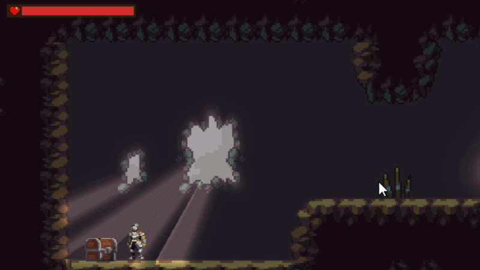

# Treasure Seeker



Unityで制作している2D横スクロールアクションゲーム。  
プレイヤー操作、近接コンボ、被ダメージ、敵AI、ステージ選択、ステージ進行、環境演出、BGM/SE制御を実装。

短いステージ構成のプロトタイプとして、小さなゲームループの構造までは実装済み。  
今後はステージギミック、敵キャラクター、プレイヤーアクションを追加してゲーム性を広げていく。

## デモ

### Stage Select


### Treasure


### Combat


## プレイ

[TreasureSeeker - itch.io](https://sassakosaksak.itch.io/treasureseeker)

このリポジトリは主にソースコード確認用。  
一部アセットは同梱していないため、Unityで開いた場合にそのまま完全には動作しない可能性あり。

## 概要

- ADキーでの左右移動、ジャンプ、近接攻撃
- 攻撃コンボ、ノックバック、無敵時間、ヒットストップ
- キノコ型Enemyの索敵、追跡、攻撃予備動作、攻撃、スタン、胞子弾
- チュートリアルステージの開始演出、宝箱イベント、敵出現、ゴール、クリア演出
- EnvironmentProfileによるBGM、環境音、ローパス、ライティング、パーティクル切り替え
- ステージ選択、リトライ、タイトル遷移などの基本UI

## 開発環境

- Unity: 6000.1.8f1
- Render Pipeline: Universal Render Pipeline
- Input: Unity Input System / Input Actions
- UI: uGUI
- Text: TextMesh Pro
- Tween: DOTween
- 主な利用パッケージ
  - 2D Animation
  - 2D Pixel Perfect
  - 2D Tilemap Extras
  - Cinemachine
  - Universal RP

## 操作

| 操作 | 内容 |
| --- | --- |
| A / D | 左右移動 |
| Jump | ジャンプ |
| Attack | 近接攻撃 / コンボ入力 |
| UI操作 | ステージ選択、リトライ、タイトルへ戻る |

入力はUnity Input SystemのInput Actionsで管理し、Player用とUI用の入力を切り替える構成。

## 実装ポイント

### プレイヤー

#### 構成

- `PlayerController`: 入力受付と各機能への橋渡し
- `PlayerMoveController`: 加速/減速、ジャンプ、落下速度調整、自動歩行
- `PlayerAttackController`: 攻撃開始、コンボ受付、アニメーションイベント連携
- `PlayerDamageController`: HP、被ダメージ、ノックバック、無敵時間、死亡処理
- `PlayerWeaponHitBox`: 攻撃判定

#### 工夫した点
- 当初`PlayerController`に全ての機能が集約され肥大化していたものを、今後の保守性や拡張性を考慮して役割ごとに分割して実装。
- 攻撃中は移動速度を下げる、攻撃中の向き変更も制限する等、プレイテスト中に発見した違和感を修正する対応を実施。
- 被ダメージ時は攻撃をキャンセルし、ノックバックと無敵時間をアニメーション状態と連携するように実装。
- 攻撃入力を受け付けるタイミングを制御し、ボタン連打だけで成立しないコンボシステムにした。

### 敵AI

#### 構成

- `EnemyControllerBase`: 被ダメージ、ノックバック、死亡、向き変更などのEnemy共通処理
- `Enemy_Mushroom`: キノコ型Enemy固有の索敵、追跡、攻撃、スタン制御
- `Enemy_Mushroom_EventRelay`: アニメーションイベントの中継
- `EnemyCollisionController`: Enemy同士の接触や押し合いに関わる判定
- `EnemyBodyAttack`: プレイヤー接触時のダメージ判定
- `Spore`: キノコ型Enemyが生成する胞子弾

#### 工夫した点

- Enemy共通処理を`EnemyControllerBase`にまとめ、`EnemyControllerBase`を継承した`Enemy_Mushroom`にキノコ型Enemy固有の行動を実装。
- キノコ型Enemyの行動は状態管理で分け、アニメーションと連携する形で攻撃開始/終了やスタン復帰を制御。
- 複数の敵が密集した際に押し合いで挙動が破綻していたため、物理衝突を無効化した上で敵同士が分離するように実装。
- 攻撃前にアニメーションで警告演出を入れ、プレイヤー側が攻撃タイミングを判断しやすいように調整。

### ステージ進行

#### 構成

- `StageFlowBase`: ステージ開始、クリア状態、クリア演出呼び出しの基底処理
- `TutorialStage`: チュートリアルステージ固有の進行制御
- `Chest`: 宝箱の開封、開封イベント、開封演出
- `Goal`: ゴール到達時のステージクリア処理
- `PlayerMessageUI`: ステージ中の簡易メッセージ表示

#### 工夫した点

- ステージ開始時やクリア時の処理を`StageFlowBase`に分離し、ステージ固有の流れを派生クラス側に寄せる構成にした。
- チュートリアルでは開始時の自動歩行、宝箱開封、敵とゴールの出現、ゴール到達後のクリア演出を順番に制御。
- 宝箱の開封をイベントとして扱い、ステージ進行側が開封タイミングを受け取って次の展開へ進める形にした。
- ゴール到達時はプレイヤー入力を止め、自動歩行とクリアUI表示までを一連の流れとして実装。

### タイトル画面

#### 構成

- `StageData`: ステージ選択に表示する名前とロードするシーン名を保持
- `StageDataCatalog`: ステージ一覧をまとめるカタログ
- `StageSelectController`: ステージボタン生成、スクロール、選択復帰、シーンロード
- `StageSelectButton`: ステージボタン単体の表示と選択時処理
- `TitleController`: タイトル画面内のメニュー階層と入力状態の管理
- `TitleMenuButton`: ボタン種別に応じた見た目や状態の切り替え

#### 工夫した点

- ステージ数増加に伴う保守性、拡張性を考慮して`StageData`と`StageDataCatalog`でデータ管理するように実装。
- ステージ追加時にコード修正が不要になるよう、`StageData`を参照してUIを自動生成する構成にした。
- マウス操作/キー操作とScrollRectの位置がずれないよう、選択Indexとスクロール位置を同期する処理を実装。

### 環境演出

#### 構成

- `EnvironmentProfile`: BGM、環境音、ローパス、ライティングPrefab、パーティクルPrefabの設定をまとめるデータ
- `EnvironmentManager`: 現在の環境プロフィールを適用
- `AreaTrigger`: エリア侵入時に環境プロフィールを切り替え
- `LightingManager`: ライティングPrefabの切り替え
- `ParticleManager`: 環境パーティクルの切り替え

#### 工夫した点

- BGM、環境音、光、パーティクルをScriptableObjectにまとめ、プログラム修正なしでエリア演出を変更できるようにした。
- 森や洞窟など、エリア単位で音と見た目の変化を同じ入口から扱えるようにした。
- ローパスフィルターの値もプロフィール側に持たせ、洞窟内のこもった音の表現に使えるようにした。
- 同じプロフィールを再適用しないようにして、不要な切り替え処理を避ける構成にした。

### オーディオ

#### 構成

- `AudioManager`: BGM、環境音、ローパスフィルターの管理
- `SEManager`: SE再生用AudioSourceの管理
- `SEEntry`: SEクリップや音量などの再生データ
- `SurfaceSESet`: 地面素材ごとの足音データ
- `PlayerSEController`: プレイヤーの足音、攻撃音などの再生
- `EnemyBaseSEController` / `MushroomSEController` / `SporeSEController`: Enemy関連SEの再生
- `ChestSEController` / `GameClearSEController` / `UISEController`: ギミック、クリア、UI操作音の再生

#### 工夫した点

- BGM、環境音、SEを分けて管理し、用途ごとの音量や再生タイミングを扱いやすくした。
- BGMと環境音はDOTweenでフェード切り替えし、急に音が切り替わらないようにした。
- SEは現状小規模のためObjectPoolは使わず、一定数のAudioSourceを事前に用意して使い回す構成にした。
- 足音やEnemy、ギミック、UIなど、音を出す対象ごとにControllerを分け、各オブジェクト側から必要なSEを呼び出しやすくした。

## ディレクトリ構成

```text
Unity-2D-Action/
  Img/                  README用画像
  2D-Action/
    Assets/
      Data/
        StageData/      ステージ選択用データ
        Environment/    環境プロフィール
      Prefabs/          UI、敵、ギミック、環境、エフェクト
      Scenes/           TitleScene、TutorialScene
      Scripts/
        Audio/          BGM、SE、各オブジェクトの音制御
        Common/         ヒットストップなど共通処理
        Core/           GameManager
        Data/           ステージデータ
        Enemy/          敵AI、敵攻撃、弾
        Environment/    環境切り替え
        Gimmick/        宝箱、ゴール
        Player/         プレイヤー操作、攻撃、ダメージ
        Stage/          ステージ進行
        UI/             タイトル、ステージ選択、HP表示
        Visual/         演出、パララックス、エフェクト
```

## 今後追加したい要素

- ステージギミックの追加
- 敵キャラクターの追加
- プレイヤーアクションの追加
- オプション画面
- ポーズ画面
- ステージ選択画面の拡張
- ボス、ボス演出の追加

## 開発期間

約1ヶ月

## 制作人数

個人制作

## 担当

- 企画
- 設計
- 実装
- UI制作
- サウンド組み込み
- デバッグ

## AI利用について

開発過程においてAIアシスタントを設計相談、コード整理、ドキュメント作成等の補助として活用。  
画像・音声・その他アセットの生成には一切不使用。  
ゲーム仕様の判断、Unity上での実装、動作確認、今後の運用や拡張性等を統合した最終的な採用判断はすべて制作者本人が実施。

